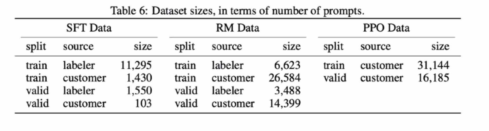
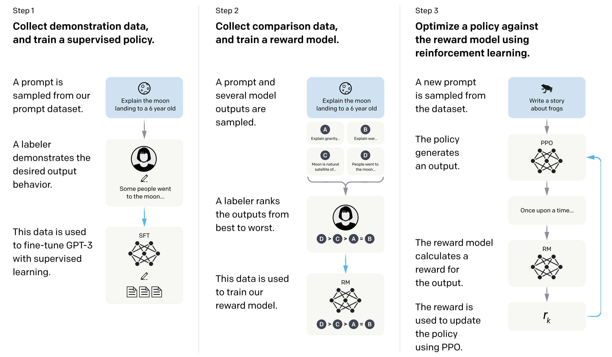
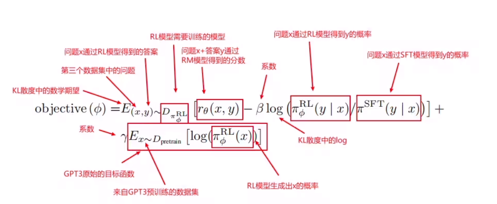

# GPT/GPT2/GPT3
GPT: pre-train model
GPT2: few shot、one shot
GPT3: multi-task learners

## In-Context Learning
特点是：不需要fine-tuning,但是每次需要送上下文

## Instruct-GPT

* data-set 
  
1. 准备3份数据集
   1. SFT Data
   2. RM Data
   3. PPO Data

* 模型训练步骤

1. 三步骤
   1. :  supervised fine-tuning (SFT), 
   2. reward model (RM) training
   3. reinforcement learning via proximal policy optimization (PPO) on this reward model.

* 关于PPO的损失函数的介绍

这里用的是强化学习，因为他的数据分布是随着策略的更新，环境会发生变化的。优化算法是PPO，Proximal Policy Optimization，近端策略优化。简单来说，就是对目标函数objective(φ)通过随机梯度下降进行优化。
目标函数理解：
优化目标是使得目标函数越大越好，objective(φ)可分成三个部分，打分部分+KL散度部分+GPT3预训练部分
1、将第三个数据集中的问题x，通过πφRL模型得到答案y
2、把一对(x,y)送进RM模型进行打分，得到rθ(x,y)，即第一部分打分部分，这个分数越高就代表模型生成的答案越好
3、在每次更新参数后，πφRL会发生变化，x通过πφRL生成的y也会发生变化，而rθ(x,y)打分模型是根据πSFT模型的数据训练而来，如果πφRL和πSFT差的太多，则会导致rθ(x,y)的分数估算不准确。因此需要通过KL散度来计算πφRL生成的答案分布和πSFT生成的答案分布之间的距离，使得两个模型之间不要差的太远。
4、我们希望两个模型的差距越小越好，即KL散度越小越好
5、如果没有第三项，那么模型最终可能只对这一个任务能够做好，在别的任务上会发生性能下降。所以第三部分就把原始的GPT3目标函数加了上去，使得前面两个部分在新的数据集上做拟合，同时保证原始的数据也不要丢，这个就是第三部分GPT3预训练部分。这里的x是GPT-3的训练数据采样出来的。
6、当γ=0时，这个模型叫做PPO，当γ不为0时，这个模型叫做PPO-ptx。InstructGPT更偏向于使用PPO-ptx。
7、最终优化后的πφRL模型就是InstructGPT的模型。

## Chain of thought

let's thinkit step by step
大模型的涌现能力；

## 参考文件

1.  > [ GPT]
   (https://s3-us-west-2.amazonaws.com/openai-assets/research-covers/language-unsupervised/language_understanding_paper.pdf) 

2.  > [ GPT2]
   (https://arxiv.org/abs/2005.14165) 
3.  > [ GP3]
   (https://d4mucfpksywv.cloudfront.net/better-language-models/language_models_are_unsupervised_multitask_learners.pdf) 

4.  > [Instruct GPT]
   (https://arxiv.org/pdf/2203.02155.pdf/) 
5.  > [ COT ]
   (https://arxiv.org/pdf/2201.11903.pdf/) 

